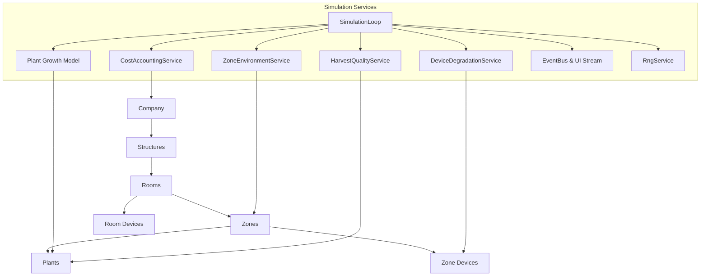
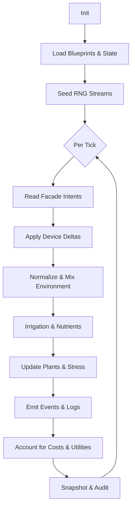

# Backend Simulation Overview

The Weedbreed simulation backend models controlled-environment cultivation as a deterministic, tick-driven world that stays decoupled from any presentation layer. Its guiding principles are fairness across hardware, deterministic replay, and transparent cause-and-effect between player actions, environmental outcomes, and plant performance. The loop runs on fixed-duration ticks, batches state commits, and only exposes intent-based APIs so UI clients never mutate internals directly. Delta-based environment physics and stress-driven plant growth produce emergent complexity while remaining explainable to operators.

## Architecture at a Glance



- **SimulationLoop** orchestrates the seven canonical phases (`applyDevices` → `commit`), measures timings, and publishes events via the shared bus, ensuring atomic state commits per tick.【F:src/backend/src/sim/loop.ts†L26-L198】
- **ZoneEnvironmentService** aggregates device deltas, applies climate controllers, normalises the zone back toward ambient conditions, and enforces safety clamps before the plant phase runs.【F:src/backend/src/engine/environment/zoneEnvironment.ts†L48-L214】
- **Plant growth model** converts blueprinted physiology into stress, health, growth, quality, and transpiration metrics, emitting alerts whenever thresholds are crossed.【F:src/backend/src/engine/plants/growthModel.ts†L1-L233】
- **Resource and cost services** convert demand curves into water/NPK usage, compute OpEx/CapEx, and accumulate utility spend for accounting events, preserving tick-length normalisation.【F:src/backend/src/engine/plants/resourceDemand.ts†L19-L199】【F:src/backend/src/engine/economy/costAccounting.ts†L13-L200】
- **Event bus & UI stream** expose snapshots, tick completions, and domain events with bounded buffers so every transport receives the same ordered payloads.【F:docs/system/socket_protocol.md†L3-L46】
- **Seeded RNG** offers named streams that can be serialised and restored, guaranteeing reproducible simulations when combined with deterministic tick scheduling.【F:src/backend/src/lib/rng.ts†L6-L146】

## Data Models: Blueprints

Blueprints are immutable JSON templates loaded into the `BlueprintRepository`; they validate against Zod schemas, expose query helpers, and support hot-reload with staging so runtime instances always reference consistent source data.【F:src/backend/src/data/blueprintRepository.ts†L17-L167】 Runtime state stores only blueprint IDs and per-instance metrics, keeping the separation between definition and simulation state clean.【F:src/backend/src/state/models.ts†L49-L259】 All physical values use SI units, aligning with the physiology helpers documented in the physio reference.【F:docs/system/wb-physio.md†L1-L53】

### Strains

Strain blueprints capture lineage, morphology, environmental preferences (temperature, humidity, PPFD), water use, NPK demand, photoperiods, and harvest windows, all keyed by growth phase for downstream conversions.【F:src/backend/src/data/schemas/strainsSchema.ts†L11-L112】 The growth model resolves these bands into Gaussian or saturation responses, derives VPD stress, and clamps biomass to blueprint caps.【F:src/backend/src/engine/plants/growthModel.ts†L43-L205】

```json
{
  "id": "550e8400-e29b-41d4-a716-446655440000",
  "name": "Example Strain",
  "environmentalPreferences": {
    "idealTemperature": { "vegetation": [22, 26] },
    "idealHumidity": { "flowering": [0.45, 0.55] },
    "lightIntensity": { "vegetation": [300, 450] }
  },
  "waterDemand": {
    "dailyWaterUsagePerSquareMeter": {
      "vegetation": 3.8,
      "flowering": 4.5
    },
    "minimumFractionRequired": 0.6
  },
  "nutrientDemand": {
    "dailyNutrientDemand": {
      "vegetation": { "nitrogen": 3.2, "phosphorus": 1.1, "potassium": 2.5 }
    },
    "npkTolerance": 0.1
  },
  "harvestWindow": [56, 63]
}
```

### Devices

Device blueprints define kind, room-purpose compatibility, efficiency attributes, and controller-facing settings such as `ppfd`, `targetTemperature`, airflow, and moisture removal capacity.【F:src/backend/src/data/schemas/deviceSchema.ts†L3-L74】 During `applyDevices`, these settings become deltas for heat, humidity, CO₂, and PPFD, with energy draw tracked for accounting.【F:src/backend/src/engine/environment/zoneEnvironment.ts†L171-L203】

```json
{
  "id": "3b5f6ad7-672e-47cd-9a24-f0cc45c4101e",
  "kind": "Lamp",
  "name": "Spectrum Pro 600",
  "roomPurposes": ["purpose-bloom"],
  "settings": {
    "ppfd": 520,
    "coverageArea": 5.6,
    "power": 0.65,
    "heatFraction": 0.35
  }
}
```

### Cultivation Methods

Cultivation methods capture layout economics—setup cost, labour intensity, area per plant, substrate/container specs, and strain compatibility bands—so zones can infer capacity and automation behaviour.【F:src/backend/src/data/schemas/cultivationMethodSchema.ts†L19-L66】

```json
{
  "id": "7a639d3d-4750-440a-a200-f90d11dc3c62",
  "name": "Vertical Racks",
  "areaPerPlant": 0.45,
  "minimumSpacing": 0.3,
  "laborIntensity": 1.2,
  "containerSpec": { "type": "fabricPot", "volumeInLiters": 11 },
  "idealConditions": { "idealHumidity": [0.5, 0.6] }
}
```

### Structure & Purpose Blueprints

Structure blueprints describe rentable shells (footprint, rent base rate, upfront fees), while room purpose blueprints constrain which devices and cultivation flows are valid in each room via flags and economic modifiers.【F:src/backend/src/state/models.ts†L60-L109】【F:src/backend/src/data/schemas/roomPurposeSchema.ts†L6-L25】 Zones reference both structure geometry and cultivation method IDs, maintaining per-zone environment, resources, devices, and planting plans.【F:src/backend/src/state/models.ts†L245-L262】

```json
{
  "id": "c701efa6-1e90-4f28-8934-ea9c584596e4",
  "name": "Warehouse Shell",
  "footprint": { "length": 40, "width": 24, "height": 8 },
  "rentalCostPerSqmPerMonth": 18,
  "upfrontFee": 25000
}
```

## Lifecycle & Sequence (Tick Orchestration)

The scheduler accumulates wall-clock time, advances whole ticks in order, and after each commit emits a snapshot plus batched events.【F:docs/system/simulation-engine.md†L12-L25】 Within a tick, the state machine executes the canonical phase order, allowing service hooks per phase and guaranteeing atomicity when `commit` completes.【F:src/backend/src/sim/loop.ts†L26-L115】 Determinism arises from fixed tick ordering, pure helper functions, and named RNG streams seeded once at initialisation.【F:docs/system/simulation-engine.md†L23-L25】【F:src/backend/src/lib/rng.ts†L6-L146】



The same loop powers replay, pausing, stepping, and speed changes exposed through the facade’s control surface.【F:docs/system/facade.md†L55-L102】

## Hierarchy & Assignment

Game state tracks company metadata (seed, economics, tick length), an array of structures, and world subsystems such as inventory, finances, workforce, and tasks.【F:src/backend/src/state/models.ts†L24-L57】 Structures provide rentable space with rooms that apply purpose constraints and cleanliness/maintenance metrics.【F:src/backend/src/state/models.ts†L82-L109】 Zones bind rooms to cultivation methods, maintain environment readings, resource reservoirs, and control setpoints, and host both plant instances and device installations.【F:src/backend/src/state/models.ts†L245-L314】 Plants are instantiated with a strain blueprint reference, stage, health, biomass, and quality fields, enabling phenology and stress calculations per tick.【F:src/backend/src/state/models.ts†L265-L291】 Devices remain attached to zones (or rooms through assignment helpers) with maintenance state and free-form settings, supporting move/toggle/update intents enforced by the facade.【F:src/backend/src/state/models.ts†L303-L314】【F:docs/system/facade.md†L86-L109】 Planting plans, irrigation overrides, and treatment queues share the same zone scope so automation and manual commands resolve consistently.【F:src/backend/src/state/models.ts†L149-L260】【F:docs/system/facade.md†L94-L107】

## Effect Models & Calculations (High-Level)

- **Light & PPFD:** Device `ppfd` outputs project across coverage area; the plant model converts canopy PPFD into photon dose and a saturation response, then multiplies by stage caps and health to update biomass and yield.【F:src/backend/src/engine/environment/zoneEnvironment.ts†L171-L203】【F:src/backend/src/engine/plants/growthModel.ts†L98-L205】
- **Climate:** HVAC, humidifiers, dehumidifiers, and CO₂ devices add deltas; normalization uses exponential approaches to pull temperature, RH, and CO₂ toward ambient based on airflow and passive leakage.【F:src/backend/src/engine/environment/zoneEnvironment.ts†L188-L214】 Physio helpers define the underlying exponential and Gaussian formulas, all in SI units.【F:docs/system/wb-physio.md†L8-L35】
- **VPD & Stress:** VPD derives from temperature and RH, with strain-specific tolerance ranges converted into Gaussian responses; deviations raise stress that lowers health and growth multipliers while generating alerts.【F:src/backend/src/engine/plants/growthModel.ts†L41-L149】
- **Water & Nutrients:** Strain curves expressed in g/m²/day and L/m²/day become per-plant, per-tick demands; available supply fractions translate into stress multipliers feeding the combined resource response.【F:src/backend/src/engine/plants/resourceDemand.ts†L19-L199】
- **Transpiration:** Estimated from VPD, canopy area, and LAI, contributing humidity back into the zone while depleting reservoirs, keeping environment and resource loops in sync.【F:docs/system/simulation-engine.md†L51-L111】【F:docs/system/wb-physio.md†L45-L60】
- **Stress & Health:** Aggregated stress drives health decay or recovery and can trigger stage transitions or quality adjustments; thresholds emit events for downstream automation.【F:docs/system/simulation-engine.md†L80-L104】【F:src/backend/src/engine/plants/growthModel.ts†L165-L233】
- **Costs:** The accounting phase multiplies utility usage by configurable prices, adds maintenance based on device age and degradation, and records rent using tick-length normalisation, separating OpEx and CapEx streams.【F:docs/system/simulation-engine.md†L173-L190】【F:src/backend/src/engine/economy/costAccounting.ts†L120-L200】

## System Interfaces

External systems interact exclusively through the facade, which validates intents, enforces invariants, and routes commands to domain services (world, devices, plants, health, workforce, finance).【F:docs/system/facade.md†L7-L125】 The same facade drives the scheduler (start, pause, step, speed changes) and provides immutable snapshots plus query utilities. Emitted events flow through the runtime event bus into the shared `uiStream$`, which batches simulation updates, tick completions, and domain events for Socket.IO and SSE adapters while preserving order and buffer limits.【F:docs/system/socket_protocol.md†L3-L46】【F:docs/system/socket_protocol.md†L62-L152】

## Reproducibility & Tests

Named RNG streams record offsets so save games can restore exact random sequences, complementing the deterministic tick scheduler.【F:src/backend/src/lib/rng.ts†L6-L146】【F:docs/system/simulation-engine.md†L23-L25】 Golden-master tests cover the physio helpers, ensuring formula stability, while integration suites replay fixed seeds to verify tick ordering, environment deltas, and accounting outputs.【F:docs/system/wb-physio.md†L55-L63】【F:docs/system/simulation-engine.md†L12-L19】 Audit snapshots and telemetry batches provide replayable evidence for long multi-day runs, enabling regression detection without UI coupling.【F:docs/system/socket_protocol.md†L62-L152】

## Glossary

- **Blueprint:** Immutable JSON definition for strains, devices, cultivation methods, or structures referenced by runtime entities via UUID IDs.【F:src/backend/src/data/blueprintRepository.ts†L17-L86】
- **Device Delta:** The per-tick temperature, humidity, CO₂, airflow, and PPFD changes contributed by a device before normalization.【F:src/backend/src/engine/environment/zoneEnvironment.ts†L171-L203】
- **Tick:** Fixed unit of simulation time processed atomically; runs all phases before emitting telemetry.【F:src/backend/src/sim/loop.ts†L26-L115】
- **Intent:** Validated command submitted to the facade that triggers world mutations while maintaining determinism.【F:docs/system/facade.md†L44-L102】
- **Event:** Structured notification carrying minimal payload (type, tick, IDs) broadcast via the shared UI stream.【F:docs/system/socket_protocol.md†L3-L46】
- **VPD (Vapour Pressure Deficit):** Difference between saturation and actual vapour pressure, derived from zone temperature and RH, used to drive transpiration and stress models.【F:docs/system/wb-physio.md†L37-L53】【F:src/backend/src/engine/plants/growthModel.ts†L72-L91】
- **OpEx / CapEx:** Operating expenses tracked per tick (utilities, maintenance, rent) versus capital expenditure for purchases, both emitted as finance events.【F:docs/system/simulation-engine.md†L173-L190】

## Appendix

- Simulation loop implementation: `src/backend/src/sim/loop.ts`
- Environment services: `src/backend/src/engine/environment/zoneEnvironment.ts`
- Plant physiology: `src/backend/src/engine/plants/growthModel.ts`
- Blueprint schemas: `src/backend/src/data/schemas/*.ts`
- Facade contract: `docs/system/facade.md`
