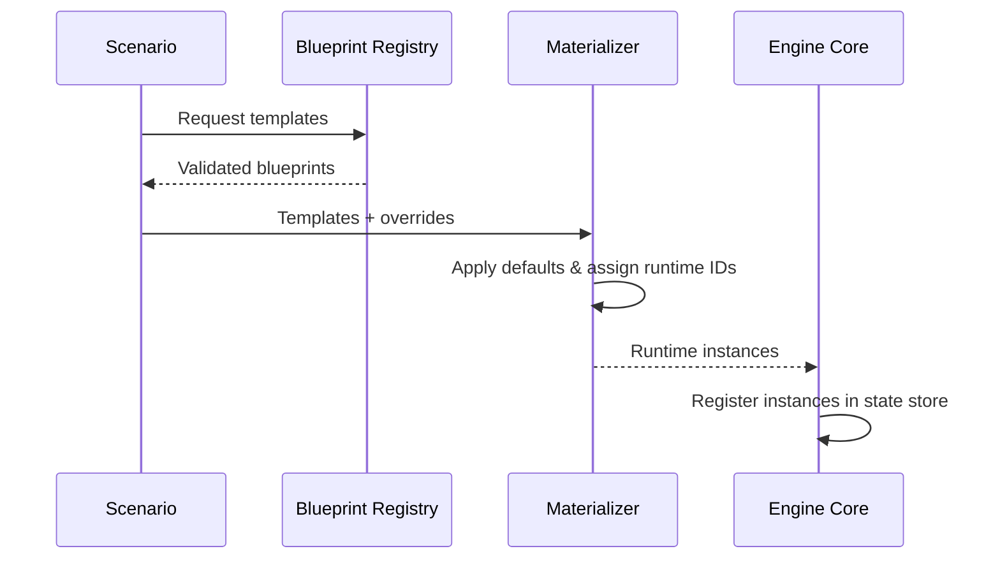
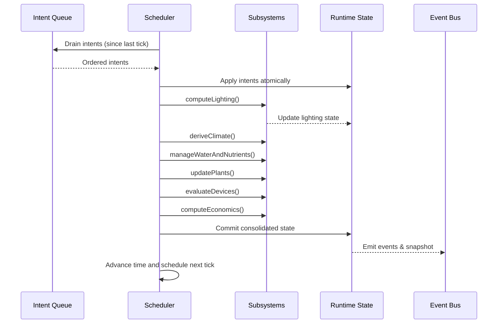
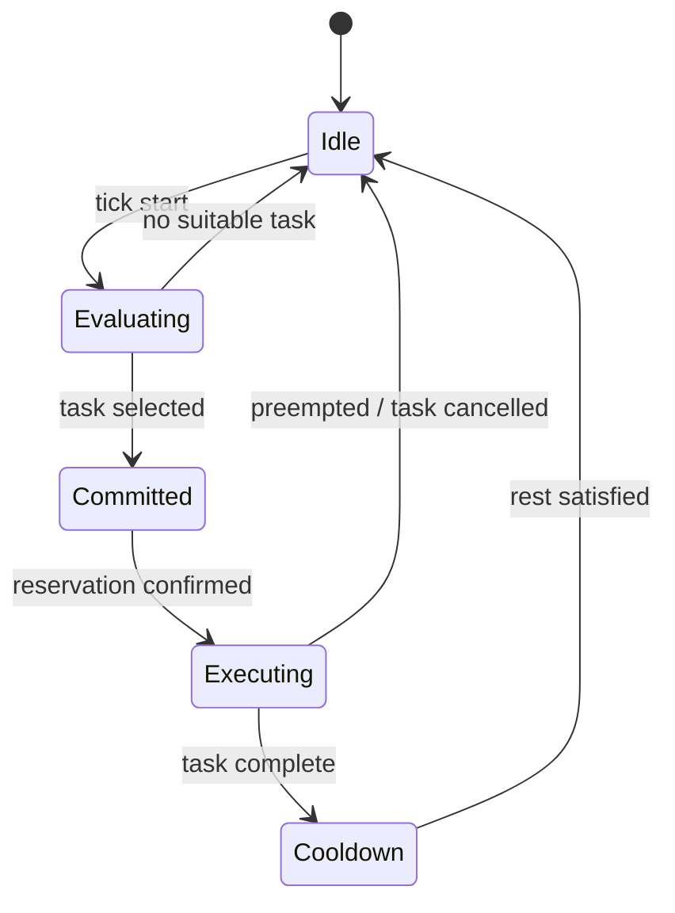

# Backend Overview

## 1. Purpose & Non-Goals

**Purpose.** Deliver a deterministic cultivation and economy simulation service with structured telemetry and intent handling, enabling external clients to orchestrate scenarios, inject commands, and observe results without direct coupling to simulation internals.

**Non-Goals.**

- Provide any user interface logic, rendering pipelines, or visualization assets.
- Introduce non-deterministic randomness or time-dependent side effects; all stochastic behaviour must stem from seeded generators.
- Bind the core engine to a specific database or storage product; persistence remains optional and pluggable.

## 2. Architecture Overview

```mermaid
flowchart LR
    subgraph Engine Core
        Scheduler[Tick Scheduler]
        StateStore[Runtime State Store]
        Physio[Simulation Subsystems]
    end
    BlueprintRegistry[Blueprint Registry]
    ScenarioLoader[Scenario Loader]
    IntentRouter[Intent Router]
    EventBus[Event & Telemetry Bus]
    PersistenceAdapter[[Persistence Adapter (optional)]]
    APIAdapter[[API Adapter (optional)]]

    BlueprintRegistry --> ScenarioLoader
    ScenarioLoader --> Scheduler
    IntentRouter --> Scheduler
    Scheduler --> StateStore
    Scheduler --> Physio
    Physio --> StateStore
    StateStore --> EventBus
    EventBus --> APIAdapter
    StateStore --> PersistenceAdapter
```

**Engine Core.** Owns the deterministic tick scheduler, subsystem orchestration, and in-memory runtime state. It does **not** manage blueprint definitions or external persistence.

**Blueprint Registry.** Stores schema-validated, read-only templates. It does **not** create runtime objects; it only exposes templates to the materialization process.

**Scenario Loader.** Resolves scenario definitions into initial runtime state by pulling blueprints, applying overrides, and delegating to the materializer. It does **not** execute ticks.

**Intent Router.** Accepts validated intents from external clients, sequences them, and hands them to the scheduler. It does **not** mutate state directly.

**Event & Telemetry Bus.** Emits ordered events, snapshots, and audit logs. It does **not** accept commands.

**Persistence Adapter (optional).** Writes snapshots or event streams to a storage backend through a well-defined port. It does **not** own in-memory state.

**API Adapter (optional).** Presents snapshots, events, and command endpoints (e.g., HTTP, WebSocket). It does **not** contain business logic beyond transport concerns.

## 3. Blueprints (Templates, Never Directly Implemented)

### 3.1 Definition

A blueprint is a read-only template describing structures, rooms, zones, plants, devices, methods, or price maps. Each blueprint is schema-validated, versioned via `schemaVersion`, and stored in canonical SI units. Blueprints are immutable once loaded. Runtime objects are created only through a **Materializer** that copies blueprint data, applies defaults, and assigns runtime identifiers.

### 3.2 General Schema Rules

- Keys use `camelCase`; values use SI units with explicit numeric values (no unit suffixes in keys or literals).
- `schemaVersion` is mandatory for compatibility checks.
- Required fields are explicitly enumerated per type; optional fields are omitted when unset. Defaults are applied by the materializer, not embedded within the template.
- Extensibility lives under `metadata` (free-form) or `extensions` (namespaced features), both optional objects that the engine ignores unless explicitly enabled.
- Validation occurs on load; failures reject the scenario load before simulation starts.

### 3.3 Blueprint Types

```ts
interface StructureBlueprint {
  schemaVersion: string;
  name: string;
  footprint: number; // m²
  volume: number; // m³
  allowedPurposes: string[];
  baseOpex: number; // EUR·h⁻¹ baseline
  metadata?: Record<string, unknown>;
  extensions?: Record<string, unknown>;
}
```

```json
{
  "schemaVersion": "1.0.0",
  "name": "Urban Warehouse",
  "footprint": 1200,
  "volume": 5400,
  "allowedPurposes": ["cultivation", "processing"],
  "baseOpex": 42
}
```

```ts
interface RoomBlueprint {
  schemaVersion: string;
  label: string;
  maxArea: number; // m²
  ceilingHeight: number; // m
  thermalProps: {
    uValue: number; // W·m⁻²·K⁻¹
    thermalMass: number; // kJ·K⁻¹
  };
  allowedZoneTypes: string[];
  metadata?: Record<string, unknown>;
  extensions?: Record<string, unknown>;
}
```

```json
{
  "schemaVersion": "1.0.0",
  "label": "Veg Room",
  "maxArea": 200,
  "ceilingHeight": 4.2,
  "thermalProps": { "uValue": 0.8, "thermalMass": 8600 },
  "allowedZoneTypes": ["grow"]
}
```

```ts
interface ZoneBlueprint {
  schemaVersion: string;
  zoneType: 'grow' | 'drying' | 'storage';
  designArea: number; // m²
  setpoints: {
    temperature: number; // °C
    relativeHumidity: number; // 0..1
    co2: number; // µmol·mol⁻¹
    vpdTarget?: number; // kPa
  };
  capacity: {
    maxPlants: number;
    maxDevices: number;
  };
  metadata?: Record<string, unknown>;
  extensions?: Record<string, unknown>;
}
```

```json
{
  "schemaVersion": "1.0.0",
  "zoneType": "grow",
  "designArea": 120,
  "setpoints": {
    "temperature": 25,
    "relativeHumidity": 0.6,
    "co2": 1100
  },
  "capacity": { "maxPlants": 240, "maxDevices": 40 }
}
```

```ts
interface PlantBlueprint {
  schemaVersion: string;
  strainId: string;
  phases: PhaseSpec[];
  photoperiod: number; // h·day⁻¹
  dliTarget: number; // mol·m⁻²·day⁻¹
  waterCurve: CurvePoint[]; // L·plant⁻¹·day⁻¹
  npkCurve: { n: CurvePoint[]; p: CurvePoint[]; k: CurvePoint[] }; // g·plant⁻¹·day⁻¹
  stressTolerance: {
    vpd: [number, number]; // kPa min/max
    temperature: [number, number]; // °C
    ec: [number, number]; // mS·cm⁻¹
  };
  yieldCoefficients: {
    biomassToDryRatio: number;
    potencyFactor: number;
  };
  metadata?: Record<string, unknown>;
  extensions?: Record<string, unknown>;
}
```

```json
{
  "schemaVersion": "1.0.0",
  "strainId": "citrus-dream",
  "phases": [
    { "name": "seedling", "minDays": 7, "maxDays": 12, "trigger": { "leafCount": 3 } },
    { "name": "vegetative", "minDays": 21, "maxDays": 35, "trigger": { "photoperiod": "flip" } },
    { "name": "flowering", "minDays": 49, "maxDays": 63, "trigger": { "trichomeMaturity": 0.2 } }
  ],
  "photoperiod": 18,
  "dliTarget": 32,
  "waterCurve": [
    { "day": 0, "value": 0.1 },
    { "day": 30, "value": 1.4 },
    { "day": 70, "value": 2.6 }
  ],
  "npkCurve": {
    "n": [
      { "day": 0, "value": 0.5 },
      { "day": 45, "value": 1.2 }
    ],
    "p": [
      { "day": 0, "value": 0.3 },
      { "day": 45, "value": 1.0 }
    ],
    "k": [
      { "day": 0, "value": 0.6 },
      { "day": 45, "value": 1.4 }
    ]
  },
  "stressTolerance": {
    "vpd": [0.6, 1.4],
    "temperature": [20, 30],
    "ec": [1.2, 2.4]
  },
  "yieldCoefficients": {
    "biomassToDryRatio": 0.25,
    "potencyFactor": 0.82
  }
}
```

```ts
interface DeviceBlueprint {
  schemaVersion: string;
  deviceClass: 'lamp' | 'climate' | 'dehumidifier' | 'co2' | 'pump';
  capacity: number; // class-specific (W, m³·h⁻¹, kg·h⁻¹)
  efficiency: number; // 0..1
  powerDraw: number; // W
  coverageArea?: number; // m²
  maintenanceCurve: MaintenancePoint[]; // failure probability per runtime hour
  metadata?: Record<string, unknown>;
  extensions?: Record<string, unknown>;
}
```

```json
{
  "schemaVersion": "1.0.0",
  "deviceClass": "lamp",
  "capacity": 650,
  "efficiency": 0.42,
  "powerDraw": 800,
  "coverageArea": 4.5,
  "maintenanceCurve": [
    { "runtimeHours": 0, "failureProbability": 0.0001 },
    { "runtimeHours": 8000, "failureProbability": 0.02 }
  ]
}
```

```ts
interface CultivationMethodBlueprint {
  schemaVersion: string;
  name: string;
  spacing: number; // m²·plant⁻¹
  trainingModifiers: {
    canopyFactor: number; // unitless
    airflowFactor: number; // unitless
  };
  pruningFactors: {
    labourMinutesPerPlant: number; // min
    wasteRatio: number; // 0..1
  };
  metadata?: Record<string, unknown>;
  extensions?: Record<string, unknown>;
}
```

```json
{
  "schemaVersion": "1.0.0",
  "name": "High-Density SCROG",
  "spacing": 0.45,
  "trainingModifiers": { "canopyFactor": 1.2, "airflowFactor": 0.9 },
  "pruningFactors": { "labourMinutesPerPlant": 18, "wasteRatio": 0.08 }
}
```

```ts
interface PriceMapBlueprint {
  schemaVersion: string;
  region: string;
  energy: number; // EUR·kWh⁻¹
  water: number; // EUR·m⁻³
  nutrients: number; // EUR·kg⁻¹
  maintenance: number; // EUR·h⁻¹
  depreciation: {
    model: 'straightLine' | 'decliningBalance';
    periodYears: number;
    rate?: number; // optional for declining balance
  };
  metadata?: Record<string, unknown>;
  extensions?: Record<string, unknown>;
}
```

```json
{
  "schemaVersion": "1.0.0",
  "region": "eu-central",
  "energy": 0.18,
  "water": 1.2,
  "nutrients": 2.6,
  "maintenance": 32,
  "depreciation": { "model": "straightLine", "periodYears": 5 }
}
```

### 3.4 Materialization Flow



**Anti-Patterns.**

- Mutating blueprint objects after load (causes cross-instance leakage).
- Calculating runtime operating expenditure directly inside device blueprints (belongs in price maps and accounting phase).
- Mixing templates with runtime IDs; keep IDs assigned only during materialization.
- Embedding randomness within blueprints; randomness is injected during runtime instantiation when required.

## 4. Identifiers & Addressing (UUIDs vs Hierarchical Keys)

Two strategies are viable for runtime addressing.

### 4.1 UUID/ULID Everywhere

- **Pros:** Collision-free IDs simplify merges between scenarios, enable durable external references, and ease integration with third-party services.
- **Cons:** Verbose identifiers increase payload size and reduce human readability. Deterministic derivation requires consistent seeding or mapping tables.

### 4.2 Hierarchical Addresses

- Example format: `structure:campusA/site3/room2/zoneB/device5`.
- **Pros:** Human-readable, compact, and encode location context within the key. Natural keys simplify reporting and manual debugging.
- **Cons:** Brittle when entities move; renames require cascading updates and a transaction protocol to ensure references remain valid. External integrations must understand the hierarchy.

### 4.3 Recommendation

Adopt **hierarchical addresses** for structures, rooms, zones, and devices as the default. They can be derived deterministically from scenario descriptors, easing debugging and designer workflows. Permit UUIDs or ULIDs for entities that frequently move (inventory batches, employees) or when external systems require opaque IDs. Document a rename protocol: create a new address, migrate dependents atomically during a tick boundary, and emit deprecation events referencing the old address. If the project later switches to UUIDs, maintain a mapping layer that records `{oldAddress, newId}` within migration metadata to preserve backward compatibility.

When omitting UUIDs for structures, enforce uniqueness within the scenario, validate during load, and require a rename ledger ensuring no collisions occur across snapshots. A structure move triggers `structure.remapped` events with both identifiers so clients can reconcile references.

## 5. Simulation Model & Formulas

All equations operate per tick with deterministic inputs. Variables use SI units; valid ranges and rationale are documented for tunability.

### 5.1 Lighting & Photosynthesis

**Key Equations.**

- `DLI (mol·m⁻²·day⁻¹) = PPFD (µmol·m⁻²·s⁻¹) × photoperiod (s) / 1e6`.
- `Q̇_heat (W) = P_input (W) × (1 − η_optical)`.
- Coverage factor `c_coverage = min(1, Σ footprint_i / zoneArea)` with diminishing returns beyond unity via `effectivePPFD = PPFD_nominal × (1 − κ × max(0, c_coverage − 1))`, where `κ ∈ [0.1, 0.4]` tunes overlap loss.

| Variable      | Description                        | Units        | Typical Range |
| ------------- | ---------------------------------- | ------------ | ------------- |
| `PPFD`        | Photosynthetic photon flux density | µmol·m⁻²·s⁻¹ | 0–1200        |
| `photoperiod` | Daily light exposure duration      | s            | 43 200–64 800 |
| `η_optical`   | Optical efficiency                 | 0..1         | 0.35–0.65     |
| `zoneArea`    | Zone surface area                  | m²           | 10–400        |
| `κ`           | Overlap loss coefficient           | unitless     | 0.1–0.3       |

`f_DLI(DLI)` adopts a saturating curve, e.g., `f_DLI = min(1, DLI / DLI_target)` for DLI below target and `exp(−γ × (DLI − DLI_target))` above target with `γ ≈ 0.05`.

### 5.2 Vapour Pressure Deficit (VPD)

Use the Buck equation for saturation vapor pressure:

- `e_s(T) (kPa) = 0.61121 × exp((18.678 − T/234.5) × (T/(257.14 + T)))`, with `T` in °C.
- `e_air = e_s(T_air) × RH`.
- `VPD_air = e_s(T_air) × (1 − RH)`.
- `VPD_leaf = e_s(T_leaf) − e_air`.

| Variable  | Description                 | Units | Typical Range |
| --------- | --------------------------- | ----- | ------------- |
| `T_air`   | Air temperature             | °C    | 18–30         |
| `T_leaf`  | Leaf temperature            | °C    | 18–32         |
| `RH`      | Relative humidity           | 0..1  | 0.45–0.75     |
| `VPD_air` | Air vapour pressure deficit | kPa   | 0.3–1.5       |

Operational bands per phase: seedling `0.4–0.8 kPa`, vegetative `0.8–1.2 kPa`, flowering `1.0–1.4 kPa`. Deviations contribute to stress accumulation and modulate transpiration.

### 5.3 Plant Growth

Phases: **Seedling → Vegetative → Flowering → Ripening/Harvest**. Transitions occur when phase-specific thresholds are met (age, biomass, photoperiod changes, maturity sensors).

Per tick biomass increment:

```
Δbiomass (g) = baseRate(strain, phase) × f_DLI(DLI) × f_T(T_air)
               × f_CO2(CO2_ppm) × f_water(availability)
               × f_npk(balance) × (1 − stressPenalty)
```

- `baseRate` derived from blueprint curves, expressed in g·plant⁻¹·tick⁻¹.
- Response functions `f_*` map to `[0, 1]` using logistic or piecewise linear curves.
- `stressPenalty` accumulates from environmental deviations: `stressPenalty = clamp(Σ w_i × excess_i, 0, 0.7)`.

Recommended response shapes:

| Function  | Shape                       | Parameters                                              | Notes                                           |
| --------- | --------------------------- | ------------------------------------------------------- | ----------------------------------------------- |
| `f_T`     | Gaussian                    | `exp(−((T_air − T_opt)²)/(2σ²))`                        | `T_opt` from blueprint; `σ ≈ 3 °C`.             |
| `f_CO2`   | Michaelis-Menten            | `CO2_ppm / (CO2_ppm + K_CO2)`                           | `K_CO2 ≈ 400 ppm`.                              |
| `f_water` | Piecewise                   | 0 at deficit beyond 30%, plateau when availability ≥1.0 | Availability derived from irrigation subsystem. |
| `f_npk`   | Min of macronutrient ratios | Compare actual vs target; penalty when <0.9 or >1.2.    |                                                 |

Stress decays exponentially: `stress_next = stress_current × (1 − λ) + stressSources`, with `λ ≈ 0.1` per day.

### 5.4 Water & Nutrients

Water uptake approximates transpiration: `uptake_water (L) = k_trans × VPD_leaf × LAI × Δt`, with `k_trans ≈ 0.04 L·kPa⁻¹·m⁻²·h⁻¹` and `Δt` in hours. Irrigation controllers maintain substrate moisture between min/max thresholds; surplus becomes runoff tracked for EC drift.

Nutrient uptake follows blueprint curves. Deviation penalty `penalty_nutrient = max(0, |actual_ppm − target_ppm| − tolerance) × β`. Tolerances narrow during flowering. Runoff increases EC; apply a bleed model `EC_next = EC_current + (uptake_deficit − leach_rate) × Δt`.

### 5.5 Climate & Energy

Heat balance per tick:

`Q_surplus (W) = Σ lamps Q̇_heat + Σ devices wasteHeat − HVAC_removal`.

Translate to temperature change using room thermal mass: `ΔT = Q_surplus × Δt / (thermalMass × 1000)` where `thermalMass` in kJ·K⁻¹ and `Δt` in seconds.

Energy consumption:

`E_tick (kWh) = Σ devices(P_W) × Δt_h / 1000`, with `Δt_h` the tick length in hours.

CO₂ injection: `CO2_consumed (g) = (setpoint − ambient) × zoneVolume × molarMass_CO2 / (R × T)` with ideal gas approximation, leak model `leak_rate` reducing concentration toward ambient.

### 5.6 Economics (OPEX/CapEx)

- OPEX per tick: `cost_energy + cost_water + cost_nutrients + cost_maintenance`.
- Maintenance increases with runtime hours via blueprint maintenance curves: `maintenanceCost = baseMaintenance × (1 + δ × runtimeHours)`.
- Depreciation options: straight-line `annualExpense = cost / periodYears`; declining balance `annualExpense = bookValue × rate`.

| Metric             | Units | Source                                |
| ------------------ | ----- | ------------------------------------- |
| `cost_energy`      | EUR   | `E_tick × priceMap.energy`            |
| `cost_water`       | EUR   | `water_used × priceMap.water`         |
| `cost_nutrients`   | EUR   | `nutrients_used × priceMap.nutrients` |
| `cost_maintenance` | EUR   | `labourHours × priceMap.maintenance`  |

### 5.7 Phase Defaults

| Phase      | DLI Target (mol·m⁻²·day⁻¹) | VPD Band (kPa) | Temperature (°C) | Notes                                         |
| ---------- | -------------------------- | -------------- | ---------------- | --------------------------------------------- |
| Seedling   | 12–16                      | 0.4–0.8        | 22–24            | Low stress tolerance, high humidity           |
| Vegetative | 30–36                      | 0.8–1.2        | 24–27            | Encourage canopy expansion                    |
| Flowering  | 30–40                      | 1.0–1.4        | 24–26            | Tight nutrient balance                        |
| Ripening   | 26–32                      | 0.9–1.2        | 22–24            | Reduced irrigation to enhance terpene profile |

## 6. Simulation Flow (Deterministic Tick Engine)



**Ordering Guarantees.** Subsystems execute in a fixed order each tick: intents, environment derivation (lighting → climate → irrigation), plant updates, device health, economics, snapshot. Each subsystem receives immutable inputs for the current tick and produces deterministic outputs.

**Determinism.** Any stochastic subsystem must accept a tick-scoped seeded RNG. Seeds propagate via `seed_next = hash(seed_prev, tickIndex, subsystemId)`.

**I/O Contracts.**

- **Intent:** `{ intentId, tickIssued, targetEntity, action, payload }`. Validation ensures entity existence and preconditions. Intents apply atomically; failures reject the entire intent with an error event.
- **Snapshot:** Immutable representation of runtime state with `tick`, `timestamp`, entity projections, and metrics. No commands are embedded.
- **Event/Telemetry:** Append-only entries `{ tick, emittedAt, type, payload }` ordered by emission time. Retention policy defined per adapter; core retains at least the last `N` ticks.

**Error Handling.** If a subsystem raises an invariant violation, the tick aborts before commit; intents are rolled back, and an error event with diagnostics is emitted. Critical failures pause the scheduler until manually resumed with a valid state correction.

## 7. Employees as Autonomous Agents

Employees operate as autonomous agents participating in a task market updated each tick.

### 7.1 Task Market

- Tasks advertise `{taskId, zoneAddress, requiredSkills, durationHours, priority, reward, capacity}`.
- Market updates at the start of each tick with new tasks from system planners or intents.
- Tasks may require reservation tokens; once capacity is reached, additional employees cannot join.

### 7.2 Decision Policy

Employees evaluate available tasks by scoring them:

```
score = w_priority × priority
      + w_skill × matchFactor(employeeSkills, requiredSkills)
      − w_distance × travelTime
      − w_fatigue × fatigue
```

- `matchFactor` ranges `[0, 1.2]` depending on proficiency surplus.
- `travelTime` derived from structure layout and employee speed (m·s⁻¹).
- `fatigue` accumulates with work hours; see §8.

### 7.3 State Machine



**Collision Rules.** Tasks specify capacity; employees acquire reservation tokens during `Committed`. If preemption is allowed, high-priority tasks can reclaim an employee by issuing a `task.preempt` event; the employee transitions to `Idle` and re-enters evaluation next tick.

**Outcome Modulation.** Task duration adjusts by `effectiveDuration = baseDuration × (1 − 0.05 × (skillSurplus)) × (1 + fatiguePenalty)`. Quality modifiers scale with `m_skill` from the skill system.

## 8. Skill System

### 8.1 Skill Model

- Skills are named dimensions (`horticulture`, `ipm`, `qa`, etc.) with levels `0–5` and an underlying continuous proficiency score.
- Employees maintain `{ skillName, level, proficiency }`. Level thresholds define proficiency bands (e.g., level 3 at `proficiency ≥ 0.6`).

### 8.2 Learning & Decay

Per task completion:

`Δskill = α_learn × exposure(taskType) − β_decay`.

- `α_learn` typically `0.01–0.05` per hour of exposure.
- `β_decay` applied per tick when a skill is unused, e.g., `β_decay = 0.001 × Δt_h`.
- Cap proficiency at `1.0`; level increments when crossing thresholds. Decay smoothly reduces proficiency toward baseline without sudden drops.

### 8.3 Matching & Performance

Tasks declare a required level. Effective multiplier:

`m_skill = clamp(1 + 0.1 × (employeeLevel − requiredLevel), 0.7, 1.3)`.

Fatigue adds a penalty `m_fatigue = 1 − min(0.4, fatigueIndex × 0.1)`. Combined performance `performance = m_skill × m_fatigue` influences task success quality and duration.

### 8.4 Fatigue & Shifts

- Fatigue increases with work: `fatigue_next = fatigue_current + workloadHours × k_work`, with `k_work ≈ 0.08`.
- Rest reduces fatigue: `fatigue_next = fatigue_current × (1 − k_rest)` when idle, `k_rest ≈ 0.2` per hour.
- Hard cap at 1.0. When fatigue exceeds 0.7, employees prefer shorter tasks or decline low-priority assignments.

## 9. Persistence & Integration (Optional Adapters)

The engine exposes ports:

- **Snapshot Sink:** Receives immutable snapshots post-commit for storage (e.g., JSON files, databases). Must acknowledge writes; failures trigger retries or backpressure.
- **Event Sink:** Consumes telemetry events; adapters may forward to WebSockets, message queues, or analytics pipelines.
- **Intent Source:** Supplies intents from transports (HTTP, WebSocket, CLI). Intent Router validates and queues them.

Adapters implement these ports without accessing internal state directly. The engine provides hooks to register adapters during bootstrapping.

## 10. Testing & Determinism

- Use deterministic seeds per subsystem; include them in save files and regression fixtures.
- Maintain golden snapshots for representative scenarios to detect drift.
- Property-based tests ensure invariants: non-negative mass balances, conservation of energy within tolerance, and monotonic stress recovery when conditions improve.
- Performance budgets: `< 100 ms` per tick for 10 ticks·s⁻¹ with 50 plants, 2 rooms, 4 zones, and 30 devices.
- Diagnostic logging includes tick index, subsystem ID, and duration for profiling.

## 11. Glossary & Naming Conventions

| Term             | Definition                                                                                      |
| ---------------- | ----------------------------------------------------------------------------------------------- |
| **Blueprint**    | Read-only template validated against schema; materialized into runtime instances.               |
| **Materializer** | Component that instantiates runtime objects from blueprints, applies defaults, and assigns IDs. |
| **Intent**       | Client-issued command describing desired state changes; atomic and validated.                   |
| **Snapshot**     | Immutable read model of current state emitted after each tick.                                  |
| **Tick**         | Fixed-duration simulation step orchestrating subsystems in deterministic order.                 |
| **Task Market**  | Matching system advertising tasks to employee agents each tick.                                 |
| **Skill**        | Quantified capability dimension for employees, ranging 0–5 with continuous proficiency.         |
| **Fatigue**      | Accumulated workload penalty reducing employee performance until rested.                        |
| **SI Units**     | All numeric values use International System of Units; conversions occur at boundaries only.     |
| **camelCase**    | Naming style for keys in JSON payloads and runtime structures.                                  |
